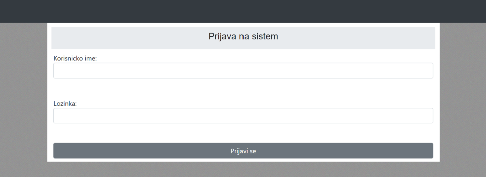
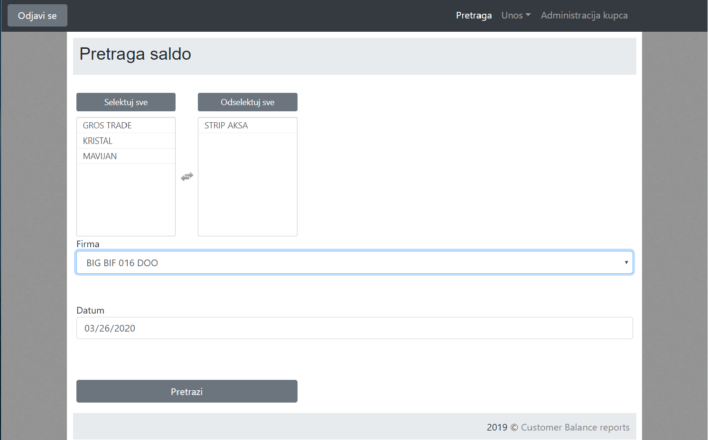
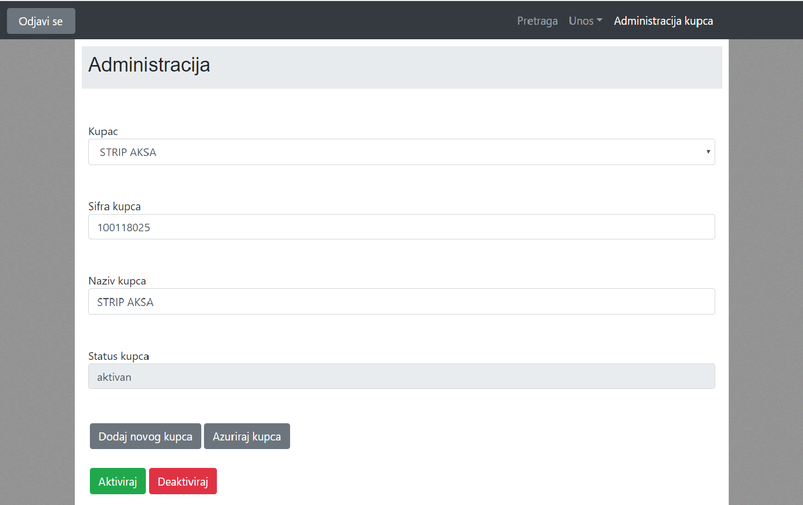
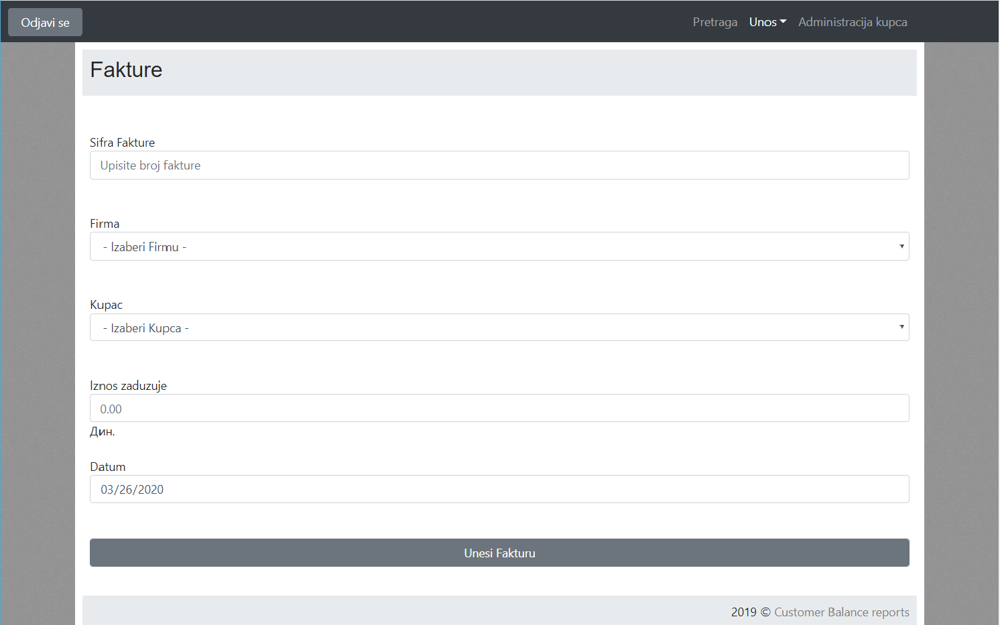
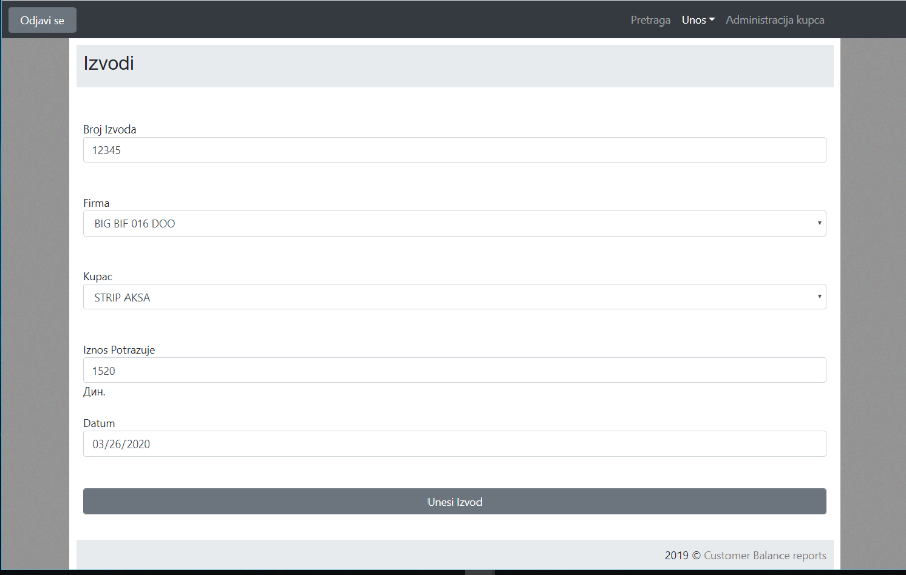

# Customer Balance reports

The Customer Balance Reports System is a [DBMS project] that helps the user (with authorization) to monitor the client's balance, with simple logic and a secured way

## Installation

1>Install XAMPP or WAMPP.

2>Open XAMPP Control panal and start [apache] and [mysql] .

3>Download project from github(https://github.com/d-miljkovic/customer_balance_reports.git).
 
 OR follow gitbash commands

    i>cd C:\\xampp\htdocs\

    ii>git clone https://github.com/d-miljkovic/customer_balance_reports.git

4>extract files in C:\\xampp\htdocs\.

5> open link localhost/phpmyadmin

6>click on new at side navbar.

7>give a database name and hit on create button ("baza" is default name for this project).

8>if you choose your own database name, please change database name in http://localhost/classes/System.class.php

9>open any browser and type http://localhost/install.php

10>open any browser and type http://localhost/customer_balance_reports

11>you will be prompt to login, admin login details  user=admin and password=admin.

## If you like my project hit a star

## Screenshots

